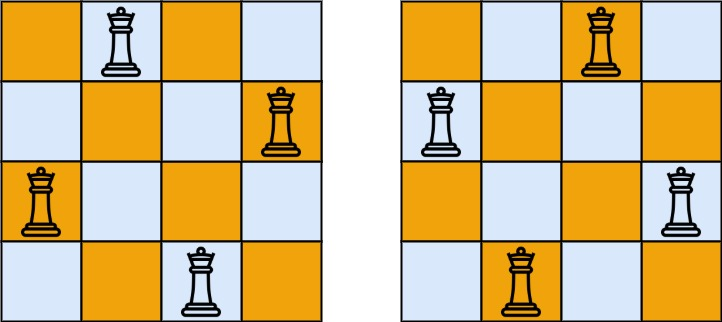

# 51. N-Queens

The n-queens puzzle is the problem of placing `n` queens on an `n x n` chessboard such that no two queens attack each other.

Given an integer `n`, return all distinct solutions to the <b>n-queens puzzle</b>. You may return the answer in any order.

Each solution contains a distinct board configuration of the n-queens' placement, where `'Q'` and `'.'` both indicate a queen and an empty space, respectively.

## Example 1:

        Input: n = 4
        Output: 2
        Explanation: There are two distinct solutions to the 4-queens puzzle as shown.
## Example 2:

        Input: n = 1
        Output: 1
        

## Constraints:

* `1 <= n <= 9`